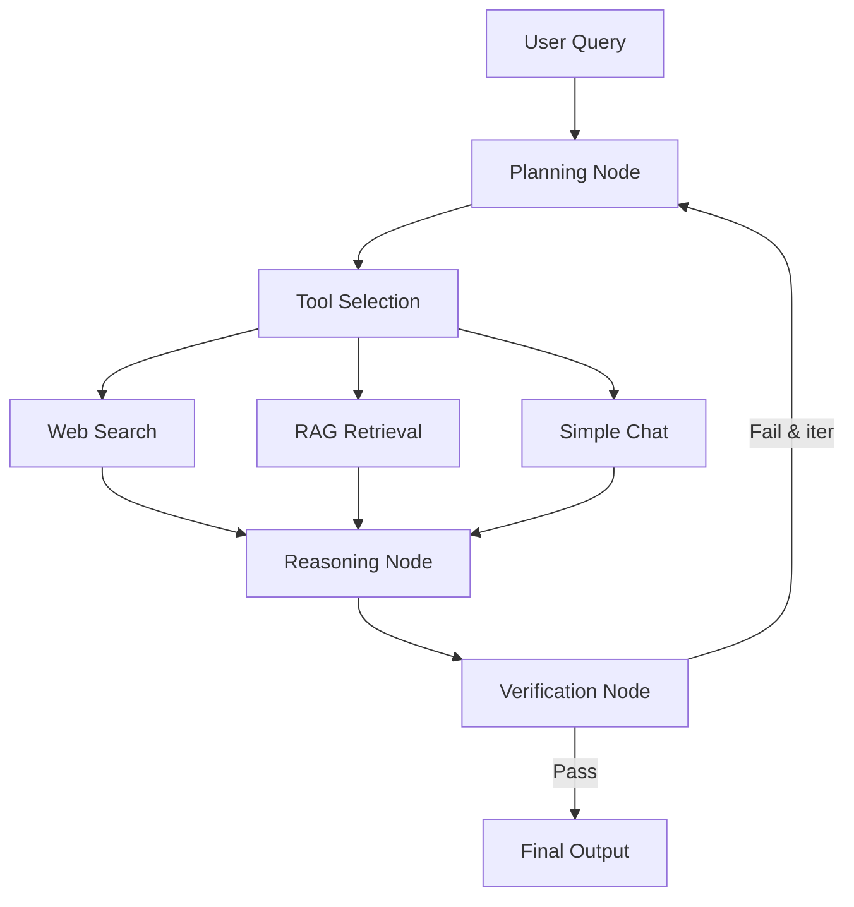

# Backend API - Quick Reference

## Quick Start

### 1. Configure Environment
```bash
cp .env.example .env
# Edit .env with your API keys and settings
```

### 2. Install Dependencies
```bash
pip install -r requirements.txt
```

### 3. Start Ollama
```bash
ollama serve
ollama pull gpt-oss:20b
```

### 4. Run Server
```bash
# Linux/Mac
./run_backend.sh

# Windows
run_backend.bat

# Or directly
python server.py
```

## Architecture

### Backend Structure
```
backend/
├── api/              # FastAPI application & routes
├── config/           # Settings & user management
├── core/             # LangGraph agent workflow
├── models/           # Pydantic schemas
├── storage/          # Conversation persistence
├── tasks/            # Task handlers (chat, agentic)
├── tools/            # External tools (search, RAG)
└── utils/            # Authentication utilities
```

### LangGraph Workflow



### Task Types

| Task | Trigger | Features |
|------|---------|----------|
| **Chat** | Default | Simple conversation, memory optional |
| **Agentic** | Keywords: search, find, analyze, document | Multi-step reasoning, tools, verification |

**Agentic triggers:** search, find, look up, research, compare, analyze, current, latest, document, file

## API Endpoints

### Authentication
- `POST /api/auth/login` - Login
- `GET /api/auth/me` - Get current user

### OpenAI Compatible
- `POST /v1/chat/completions` - Chat with AI
- `GET /v1/models` - List available models

### File Management
- `POST /api/files/upload` - Upload document for RAG
- `GET /api/files/documents` - List uploaded files

### Health
- `GET /` - API info
- `GET /health` - Health check

## Configuration (.env)

### Required Settings
```env
# Server
SERVER_HOST=0.0.0.0
SERVER_PORT=8000
SECRET_KEY=<generate-strong-key>

# Ollama
OLLAMA_HOST=http://localhost:11434
OLLAMA_MODEL=gpt-oss:20b

# Tavily (for web search)
TAVILY_API_KEY=<your-key>

# Vector DB
VECTOR_DB_TYPE=faiss
EMBEDDING_MODEL=sentence-transformers/all-MiniLM-L6-v2
```

See `.env.example` for all options.

## Usage Examples

### Login
```bash
curl -X POST http://localhost:8000/api/auth/login \
  -H "Content-Type: application/json" \
  -d '{"username":"guest","password":"guest_test1"}'
```

### Chat
```bash
curl -X POST http://localhost:8000/v1/chat/completions \
  -H "Authorization: Bearer <token>" \
  -H "Content-Type: application/json" \
  -d '{
    "model": "gpt-oss:20b",
    "messages": [
      {"role": "user", "content": "Search for latest AI news"}
    ]
  }'
```

### Upload Document
```bash
curl -X POST http://localhost:8000/api/files/upload \
  -H "Authorization: Bearer <token>" \
  -F "file=@document.pdf"
```

## Tools

### Web Search Tool
- **Primary:** Tavily API (requires API key)
- **Fallback:** websearch_ts module
- **Location:** `backend/tools/web_search.py`

### RAG Retriever
- **Vector DB:** FAISS or Chroma
- **Embeddings:** Sentence Transformers
- **Formats:** PDF, DOCX, TXT, JSON
- **Location:** `backend/tools/rag_retriever.py`

## Default Users

| Username | Password | Role |
|----------|----------|------|
| guest | guest_test1 | guest |
| admin | administrator | admin |

**Change in production!**

## Key Features

✅ **OpenAI-compatible API** - Drop-in replacement
✅ **LangGraph workflow** - Multi-step agentic reasoning
✅ **Web search** - Tavily API with fallback
✅ **RAG support** - Document Q&A with vector search
✅ **Conversation memory** - Persistent chat history
✅ **Authentication** - JWT-based auth
✅ **No fallbacks** - All settings must be configured
✅ **Task-oriented** - Clear folder structure
✅ **Easily expandable** - Add tools/tasks easily

## Adding New Tools

1. Create `backend/tools/your_tool.py`:
```python
class YourTool:
    async def execute(self, input: str) -> str:
        # Tool logic here
        return result

your_tool = YourTool()
```

2. Import in `backend/core/agent_graph.py`

3. Add node to workflow:
```python
workflow.add_node("your_tool", your_tool_node)
workflow.add_edge("tool_selection", "your_tool")
```

4. Update tool selection logic

## Logs & Debugging

- **Logs location:** `backend/logs/app.log`
- **Set debug level:** `LOG_LEVEL=DEBUG` in `.env`
- **API docs:** http://localhost:8000/docs

## Troubleshooting

### "Configuration error"
→ Copy `.env.example` to `.env` and configure all variables

### "Ollama connection failed"
→ Start Ollama: `ollama serve`
→ Pull model: `ollama pull gpt-oss:20b`

### "Tavily API error"
→ Check `TAVILY_API_KEY` in `.env`
→ Fallback will use websearch_ts

### Port 8000 in use
→ Change `SERVER_PORT` in `.env`

## Documentation

- **Full setup:** [SETUP.md](SETUP.md)
- **Project overview:** [CLAUDE.md](CLAUDE.md)
- **API docs:** http://localhost:8000/docs
- **Alternative docs:** http://localhost:8000/redoc

---

**Ready to run! See SETUP.md for detailed instructions.**
